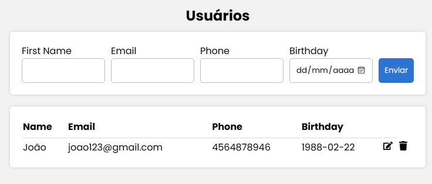

**# Crud app mysql database**

Aplicação simples com operações crud para cadastro de usuários

**## Table of contents**

- [Table of contents](#table-of-contents)

- [Overview](#overview)

- [The challenge](#the-challenge)

- [Screenshot](#screenshot)

- [Links](#links)

- [My process](#my-process)

- [Built with](#built-with)

- [Author](#author)

**## Overview**

**### The challenge**

Users should be able to:

- Criar usuários
- Atualizar usuários
- Deletar usuários
- Listar usuários

**### Screenshot**

**### Links**

- Solution URL: [Add solution URL here](https://your-solution-url.com)
- Live Site URL: [Add live site URL here](https://your-live-site-url.com)

**## My process**

**### Built with**

- React
- Styled Components
- Node/Express
- MySQL
- React toastify -> [Toastify](https://fkhadra.github.io/react-toastify/introduction/)

**## Author**

[Portfolio](https://levymatias.github.io/Portfolio/)

[Linkedin](https://www.linkedin.com/in/levy-matias/)